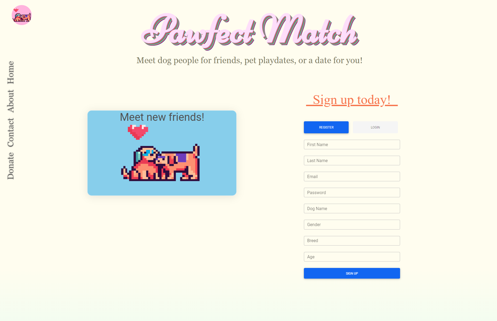

# Pawfect Match🐶💘

Welcome 😊👋

## Table of Contents 📓

- [Pawfect Match🐶💘](#pawfect-match)
  - [Table of Contents 📓](#table-of-contents-)
  - [Description 📝](#description-)
  - [Visuals 📷](#visuals-)
  - [Installation 🔃](#installation-)
  - [Deployment 👨‍💻](#deployment-)
  - [Contributors 🦾](#contributors-)
  - [License 🔑](#license-)

## Description 📝

This application was built using Mongo Db, Express.js, React, and Node.js or the MERN stack. This app allows you to sign up to create your account or sign in to your existing account to begin your adventure through Pawfect Match, our non-profit dog based social media website. Once logged in you will be able to create your own profile, make text or photo posts, like posts, comment on posts, and follow others. This was meant to be created for the dog lovers out there who would like to make new freinds with other dog lovers, set up play dates, or even meet someone for yourself! As dog lovers ourselves, we added the ability to make a donation, using Stripe, to help support dogs in need of help.

## Visuals 📷

 

 

## Installation 🔃

If you would like to install this app on your local machine you will need to clone the repo then run 

`npm i`

once you have installed your dependencies you must run 

`npm run seed`

once you have seeded your database you can start the application by running

`npm run start`

## Deployment 👨‍💻

Deployed on [Heroku](https://a-pawfect-match.herokuapp.com)

## Contributors 🦾

Andrew Choi

Gassan Bundakji

Jayden Trinh

Jeffrey Tran

Michael Bautista

## License 🔑

MIT License

Copyright (c) [2022]  [Andrew-Choi] [Gassan-Bundakji] [Jayden-Trinh] [Jeffrey-Tran] [Michael-Bautista]

Permission is hereby granted, free of charge, to any person obtaining a copy of this software and associated documentation files (the "Software"), to deal in the Software without restriction, including without limitation the rights to use, copy, modify, merge, publish, distribute, sublicense, and/or sell copies of the Software, and to permit persons to whom the Software is furnished to do so, subject to the following conditions:

The above copyright notice and this permission notice shall be included in all copies or substantial portions of the Software.

THE SOFTWARE IS PROVIDED "AS IS", WITHOUT WARRANTY OF ANY KIND, EXPRESS OR IMPLIED, INCLUDING BUT NOT LIMITED TO THE WARRANTIES OF MERCHANTABILITY, FITNESS FOR A PARTICULAR PURPOSE AND NONINFRINGEMENT. IN NO EVENT SHALL THE AUTHORS OR COPYRIGHT HOLDERS BE LIABLE FOR ANY CLAIM, DAMAGES OR OTHER LIABILITY, WHETHER IN AN ACTION OF CONTRACT, TORT OR OTHERWISE, ARISING FROM, OUT OF OR IN CONNECTION WITH THE SOFTWARE OR THE USE OR OTHER DEALINGS IN THE SOFTWARE.

