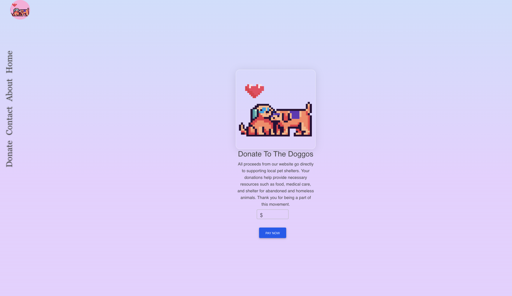

# Pawfect Help🐶💘

[](https://opensource.org/licenses/MIT)    

Welcome 😊👋

## Table of Contents 📓

- [Pawfect Help🐶💘](#pawfect-help)
  - [Table of Contents 📓](#table-of-contents-)
  - [Description 📝](#description-)
  - [Visuals 📷](#visuals-)
  - [Installation 🔃](#installation-)
  - [Deployment 👨‍💻](#deployment-)
  - [Contributors 🦾](#contributors-)
  - [License 🔑](#license-)

## Description 📝


Welcome to our MERN stack website built with GraphQL, Apollo servers, Express, Node.js, React, and Stripe. This website is a platform for dog lovers to connect with each other and donate to local pet shelters.

Our website uses GraphQL to provide a flexible and efficient way to query and mutate data, and Apollo servers to handle GraphQL operations on the server-side. We also use Express and Node.js to build the server and handle routing, and React for the client-side interface. Finally, we utilize Stripe for secure and convenient donation processing.

Thank you for supporting our mission to improve the lives of pets in need through donations to local shelters. We hope you enjoy using our website and connecting with other dog lovers.

## Visuals 📷


<br>

<br>


## Installation 🔃

If you would like to install this app on your local machine you will need to clone the repo then run 

```sh
  npm i
```

once you have installed your dependencies you must run 
```sh
  npm run seed
```
once you have seeded your database you can start the application by running
```sh
  npm run start
```

## Deployment 👨‍💻

Deployed on [Heroku](https://a-pawfect-help.herokuapp.com/)

## Contributors 🦾

Gassan Bundakji

Jayden Trinh

Jeffrey Tran

Michael Bautista

Andrew Choi

 
## License 🔑

MIT License

Copyright (c) [2022]  [Gassan-Bundakji] [Jayden-Trinh] [Jeffrey-Tran] [Michael-Bautista] [Andrew-Choi] 

Permission is hereby granted, free of charge, to any person obtaining a copy of this software and associated documentation files (the "Software"), to deal in the Software without restriction, including without limitation the rights to use, copy, modify, merge, publish, distribute, sublicense, and/or sell copies of the Software, and to permit persons to whom the Software is furnished to do so, subject to the following conditions:

The above copyright notice and this permission notice shall be included in all copies or substantial portions of the Software.

THE SOFTWARE IS PROVIDED "AS IS", WITHOUT WARRANTY OF ANY KIND, EXPRESS OR IMPLIED, INCLUDING BUT NOT LIMITED TO THE WARRANTIES OF MERCHANTABILITY, FITNESS FOR A PARTICULAR PURPOSE AND NONINFRINGEMENT. IN NO EVENT SHALL THE AUTHORS OR COPYRIGHT HOLDERS BE LIABLE FOR ANY CLAIM, DAMAGES OR OTHER LIABILITY, WHETHER IN AN ACTION OF CONTRACT, TORT OR OTHERWISE, ARISING FROM, OUT OF OR IN CONNECTION WITH THE SOFTWARE OR THE USE OR OTHER DEALINGS IN THE SOFTWARE.


